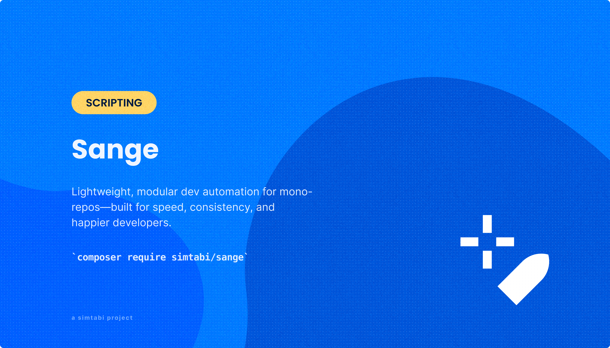

<div align="center">
   
   <br />
</div>

<br>

<div align="center">
   <strong>Sange</strong>
</div>
<div align="center">
<p>
Lightweight, modular dev automation for mono-repos—built for speed, 
consistency, and happier developers.
</p>
</div>
<div align="center">
   <a href="https://simtabi.com">Website</a> 
   <span> · </span>
   <a href="https://github.com/simtabi/sange">GitHub</a> 
   <span> · </span>
   <a href="https://discordapp.com/users/955429267855007744">Discord</a>
</div>

<br>
<hr>


# 🐘 Sange – Developer Automation Toolkit — WIP

**Sange** is a modular, extensible automation toolkit powered by **Makefiles** and **Bash**.  
It helps streamline repetitive development tasks like Git workflows, Docker commands, Laravel tooling, and more.

**Sange**—named after the nimble and resilient *Elephant Shrew*—is designed for teams that demand **lightweight, dependable DevOps workflows**. Whether you’re working with **mono-repos, microservices, or full-stack systems**, Sange scales with precision and power.

---

## 🚀 Why Sange?

- ✅ Designed for **mono-repos** and **multi-project environments**
- ⚙️ Uses Make + Bash — no extra binaries or dependencies
- 🧩 Stack-based and extensible: Laravel, Docker, NPM, and more
- 💡 Built with modularity, readability, and reusability in mind

---

## 📚 Documentation

Each stack has its own documentation:

- 🔗 [Git Commands](./docs/git.md)
- 🐳 [Docker Commands](./docs/docker.md)
- 📦 [NPM/Yarn Commands](./docs/npm.md)
- ⚙️ [Laravel Commands](./docs/laravel.md)
- 🐍 [Python Stack (Optional)](./docs/python.md)
- 🧰 [Makefile Generator](./docs/makefile-generator.md)

---

## 🧩 Directory Structure

```
sange/
├── .github/                      # GitHub workflows, issue templates, etc.
├── docs/                         # Stack-specific documentation
│   ├── git.md
│   ├── docker.md
│   ├── npm.md
│   ├── laravel.md
│   ├── python.md
│   └── makefile-generator.md
│   └── ...
├── src/
│   ├── configs/                  # Global variables and config defaults
│   ├── makefiles/                # Core and stack-specific Makefiles
│   │   ├── supports/             # Generators, initializers, shared logic
│   │   ├── docker.mk
│   │   ├── git.mk
│   │   ├── npm.mk
│   │   ├── laravel.mk
│   │   ├── ...
│   ├── scripts/                  # Helper shell scripts (git.sh, sange.sh, etc.)
│   └── sange.mk                  # Master Makefile entry point
├── templates/                    # Makefile scaffolding templates
│   └── makefile.template
└── README.md                     # This file
```

---

## 🛠️ Installation

```bash
git clone https://github.com/simtabi/sange.git
cd sange
```

Then, include the core Makefile in your project-specific `makefile`:

```makefile
# Example project Makefile

GIT_REPO := $(CURDIR)
DEFAULT_COMMIT_MESSAGE := '📦 chore(my-app): update'

include path/to/sange/src/sange.mk
```

---

## 🧠 Philosophy

Sange is designed to **help teams automate without overengineering**:

- No lock-in
- No dependencies
- Easy to audit
- Easy to extend
- Made for both beginners and power users

---

## 📝 License

MIT © Simtabi
